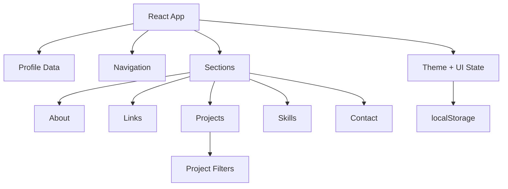

# ✦ Nexora — Developer Identity, One Link

<p align="center">
  <strong>A premium developer profile experience built with React and TypeScript.</strong><br>
  One place for a developer's identity, projects, skills, social links, and contact.
</p>

<p align="center">
  <a href="https://nexoradevweb.netlify.app/">🌐 Live Demo</a> ·
  <a href="https://github.com/harshitdev-wq/nexora-developer-profile/issues">🐛 Report a Bug</a> ·
  <a href="https://github.com/harshitdev-wq/nexora-developer-profile/issues">💡 Request a Feature</a>
</p>

---

## ✨ The idea

Developer identities are scattered across GitHub, LinkedIn, portfolios, resumes, and social platforms.

**Nexora brings the important pieces together in one focused profile.**

The current build is a polished public-profile experience designed around a dark, editorial interface: strong typography, fine borders, subtle motion, project filtering, quick-link actions, and a responsive layout that works across screen sizes.

## 🎯 Current experience

- **Public developer profile** — name, bio, location, availability, and quick facts.
- **Social hub** — GitHub, LinkedIn, portfolio, and email in one place.
- **Featured work** — real projects with source and demo actions.
- **Project filtering** — quickly filter work by Web, Python, C++, or Other.
- **Skills system** — grouped technologies instead of a noisy logo wall.
- **Theme switcher** — dark/light preference with local persistence.
- **Copy actions** — profile URL and email can be copied directly.
- **Scroll navigation** — active section tracking and smooth navigation.
- **Mobile menu** — keyboard-friendly navigation with Escape support.
- **Responsive hardening** — project cards, media, text, and actions are protected against overflow and layout collisions.
- **Accessibility details** — semantic markup, focus states, reduced-motion support, fallbacks, and keyboard navigation.

## 🧱 Architecture



The UI is intentionally data-driven: profile information, links, projects, skills, navigation, and stats live in `src/data.ts`, while the application logic lives in `src/App.tsx`.

## 🛠️ Tech Stack

| Layer | Technology |
| --- | --- |
| UI | React 19 |
| Language | TypeScript |
| Build tool | Vite 7 |
| Styling | Tailwind CSS 4 + custom CSS |
| Icons | Lucide React |
| Utilities | clsx, tailwind-merge |
| Deployment | Netlify |

## 📁 Project Structure

```text
nexora-developer-profile/
├── public/                  # Static assets and public files
├── src/
│   ├── App.tsx              # Main UI and interaction logic
│   ├── data.ts              # Profile, projects, skills and navigation data
│   ├── icons.tsx             # Brand icon components
│   ├── index.css             # Core design system
│   ├── visual-fixes.css      # Responsive/layout hardening
│   └── main.tsx              # React entry point
├── index.html
├── package.json
├── tsconfig.json
├── vite.config.ts
├── LICENSE
└── README.md
```

## ⚡ Run locally

### Requirements

- Node.js 18+
- npm

### Install

```bash
git clone https://github.com/harshitdev-wq/nexora-developer-profile.git
cd nexora-developer-profile
npm install
```

### Development

```bash
npm run dev
```

### Production build

```bash
npm run build
```

### Preview production build

```bash
npm run preview
```

## 🌐 Live Demo

**[nexoradevweb.netlify.app](https://nexoradevweb.netlify.app/)**

## 🔭 Roadmap

The next product-level steps for Nexora are intentionally focused on usefulness rather than adding random visual effects:

- [ ] GitHub profile integration
- [ ] Automatic repository/project importing
- [ ] Custom public profile URLs
- [ ] Profile editing dashboard
- [ ] Shareable profile cards
- [ ] Social preview generation
- [ ] Basic profile/link analytics

## 🧠 What this project demonstrates

Nexora is more than a landing page exercise. It demonstrates the practical frontend loop:

**idea → information architecture → responsive UI → interaction design → deployment → iteration**

The project also includes a dedicated visual-hardening layer after testing the deployed interface, specifically to prevent project-card overlap, unstable media sizing, long-text overflow, and small-screen layout failures.

## 🤝 Contributing

Ideas and constructive feedback are welcome.

1. Fork the repository.
2. Create a feature branch.
3. Make your change.
4. Run the production build locally.
5. Open a pull request with a clear description.

## 📄 License

Released under the **MIT License**. See [`LICENSE`](./LICENSE) for details.

---

<p align="center">
  Built by <strong>Harshit Singh</strong> — learning by shipping.
</p>
